<p align="center">
  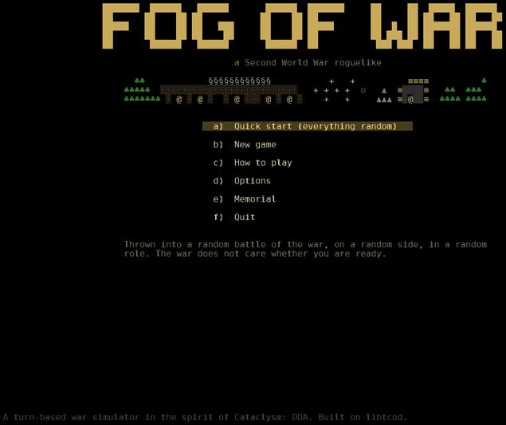
</p>

<p align="center">
  <b>A Second World War roguelike. You are one soldier, and the whole war is simulated around you.</b><br>
  Turn based or optional real time (one turn is one second) · procedurally generated and endless · sprites or ASCII ·
  synthesised sound · deliberately unfair
</p>

<p align="center">
  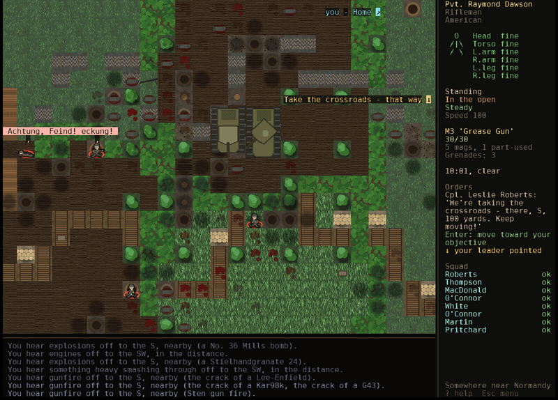
</p>

You spawn as a rifleman in the Normandy hedgerows, a flamethrower operator at Kursk, a seaman on
an AA mount on a carrier off Okinawa, the bomb aimer of a B-17, a Soviet sniper in Stalingrad,
or a five-star general with a whole front under you. The battle goes on whether you're ready or
not: squads fight with their own Dijkstra-map AI, orders travel by voice, runner and radio, the
front moves at every strategic tick, and the numbers on the general's map are men you could walk
over and count. It's in the spirit of *Cataclysm: Dark Days Ahead*, built on
[python-tcod](https://github.com/libtcod/python-tcod).

## Install

You need **Python 3.10 or newer** ([python.org](https://www.python.org/downloads/); macOS and most
Linux distributions already have it). Then:

**macOS / Linux**

```sh
git clone https://github.com/Hellisotherpeople/fog-of-war.git
cd fog-of-war
python3 -m venv .venv
.venv/bin/pip install -r requirements.txt
.venv/bin/python main.py
```

**Windows** (PowerShell or cmd)

```bat
git clone https://github.com/Hellisotherpeople/fog-of-war.git
cd fog-of-war
py -m venv .venv
.venv\Scripts\pip install -r requirements.txt
.venv\Scripts\python main.py
```

That's all: three packages (`tcod`, `numpy`, `pillow`), no other assets to download. Soldiers'
shouts and radio traffic are spoken through your system's speech engine if it has one: built in on
macOS, and on Linux or Windows install [espeak-ng](https://github.com/espeak-ng/espeak-ng)
(`sudo apt install espeak-ng`). Without it the game is the same, just quieter.

**Natural voices (optional).** For voices that sound like people rather than a speech engine,
install [Piper](https://github.com/rhasspy/piper), a small neural voice that runs on your own
machine:

```sh
.venv/bin/pip install -r requirements-voices.txt      # Windows: .venv\Scripts\pip ...
```

The game fetches one voice per language the first time a battle needs it (60-80 MB each, into
`~/.fogofwar/piper`). The American and British voices come with hundreds of speakers, so every
soldier sounds like himself. The system voice speaks until a voice arrives, and always for
Japanese and Chinese. Esc > Options > Voice engine switches back to the system voice.

**Faster (optional).** The soldiers' route-finding and their lines of sight run several times
quicker with [numba](https://numba.pydata.org/) installed; big battles feel it most:

```sh
.venv/bin/pip install -r requirements-fast.txt        # Windows: .venv\Scripts\pip ...
```

The game is the same either way, turn for turn; set `FOW_NO_NUMBA=1` to switch it off.

Saves, settings and the memorial to the fallen live in `~/.fogofwar/`.

## Your first minutes

Pick **Quick start** and the war picks everything for you, or **New game** to choose side,
battle, nation, service, role, rank and kit. **Vehicle** and **Position** guarantee an exact ground
vehicle and crew seat: for example, an M4 Sherman driver, gunner or commander. Selecting a vehicle
matches your nation and side to an operating army; a Tiger II selects Germany / Axis. For a foreign
crew, opt into **Vehicle use → Captured equipment** and choose your nation and model.

Press **/** to find a command during play, or search choices in menus. It also finds items in your
kit and visible loot, known locations on the map, nearby entries, orders, formations, settings,
and text in logs and records. Type to filter, use arrows, then Enter; Esc clears the search first.

Then:

- **Look at the panel on the right.** Your body, your weapon, and your **orders**. Press **Enter**
  and you'll carry them out: walk to the objective, take the ammunition to the gunner, go to your
  battle station.
- `T` explains which orders govern and which local instructions support them. Your scenario briefing
  takes priority unless equal or higher authority issues new orders; conflicting errands are deferred.
- **F6** enables optional real time. Everyone shares the same clock and action costs. Options lets you
  slow the pace equally for everyone; menus pause, aiming does not.
- Move with the arrow keys, numpad or `hjklyubn`; left-click to walk somewhere. `c` crouch, `p`
  go prone. **Get down behind something that stops bullets.**
- `f` to aim and fire (`a` aims longer), `r` reload, `t` throw, `B` bandage, `Y` shout for a medic.
- `i` your kit, `g` pick up, `x` look (or just hover the mouse), `V` everything around you in a list,
  `m` the map, `@` your health.
- `e` gets you into a vehicle beside you (or up onto a tank's hull to ride), and out again.
  Right-click anything for what you can do with it.
- Behind the line, walk into the men at their posts to talk: the adjutant has orders for you.
- `C` includes acting appointments, command transfers, standing missions and engineer construction.
  `T` marks workshop destinations and higher-HQ conferences. Map sheets contain dated reports;
  visit HQ to copy newer intelligence. Skill, witnessed service credit and promotion are separate.
  [Command and realism notes](docs/COMMAND_REALISM.md) explain the systems and historical approximations.
- A line under your orders gives the keys for whatever's beside you. `?` or F1 opens the help at
  **Right now**: the keys for where you are, in bold, with every other key a section or a `/` search
  away ([the full list](docs/CONTROLS.md)). Esc for the menu (save and quit). F2 switches sprites and
  ASCII, F3 sound.

You will die. The memorial remembers.

## A look around

<table>
<tr>
<td width="50%">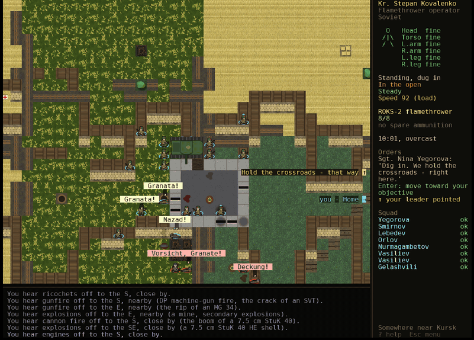<br>
<b>Kursk, July 1943.</b> Armour and infantry fighting over a village crossroads. Every vehicle has
real armour per facing and a crew doing their own seat's job.</td>
<td width="50%">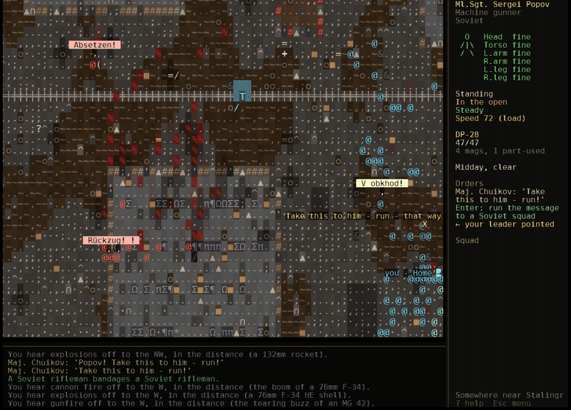<br>
<b>The same game in ASCII:</b> street fighting in Stalingrad. F2 switches between the two at any
time.</td>
</tr>
</table>

<p align="center">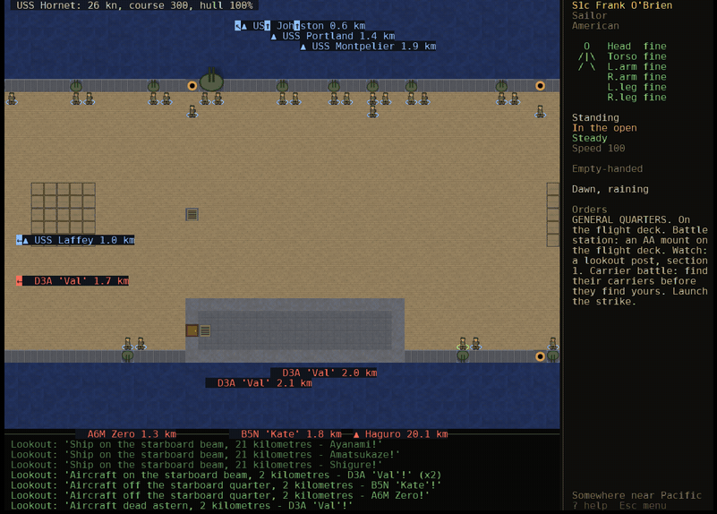</p>

**One man on a carrier.** You aren't the ship: you're a seaman on a 270-metre Essex-class
carrier with 2,600 men aboard, every deck built at real size. Here, general quarters, and a
Japanese strike of dive bombers, torpedo planes and a kamikaze coming in over the flight deck.
Hits land on the deck they would really hit; below decks you feel them through the hull.

<table>
<tr>
<td width="50%">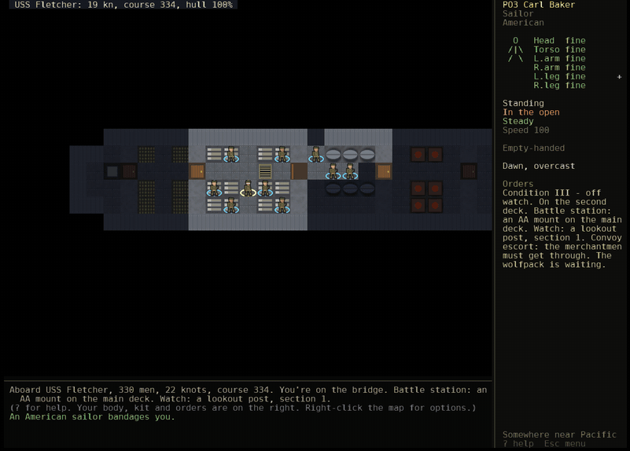<br>
<b>General quarters.</b> Below in a destroyer's berthing compartment when the alarm goes: Enter
takes you up the ladder and along the deck to your gun. Off watch, <code>Z</code> lets the hours go
by until something needs you.</td>
<td width="50%">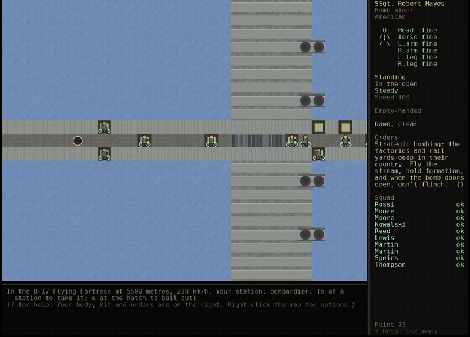<br>
<b>Inside a B-17</b> over the target: the crew at their stations, flak bursting outside, and
fragments coming through the skin into the men at those stations.</td>
</tr>
</table>

<p align="center">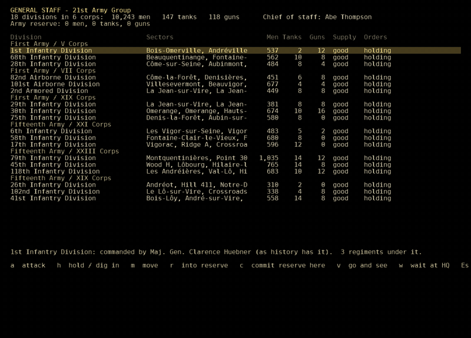</p>

**Five stars.** The general staff (`G`): divisions, corps and armies with their historical
commanders where history has them. The command tree (`C`): every formation down to the squads on
the ground, all of which you can order. The war map (`m`): the front, sector by sector, with
attacks you order fought where you can go and watch them.

<table>
<tr>
<td width="50%">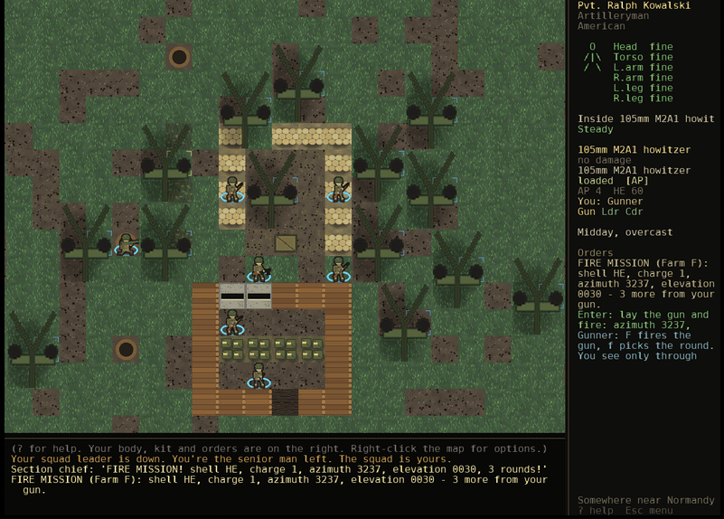<br>
<b>The gun line.</b> A real battery with its own guns and its own rounds. Fire missions come down with
the charge, azimuth and elevation; the observer reports what they did. Then the enemy's
sound-rangers find you, and the counter-battery fire comes back from their guns.</td>
<td width="50%">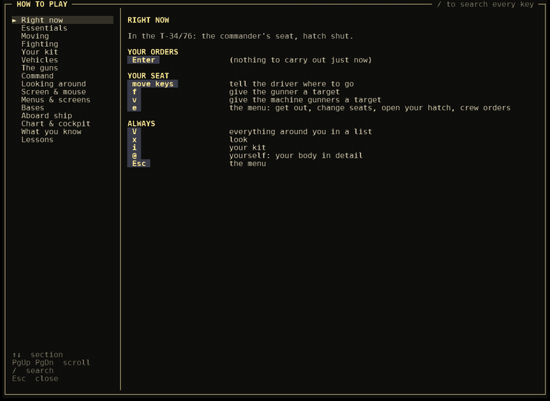<br>
<b>Help that knows where you are.</b> F1 opens at "Right now": the keys for your seat, your orders
and whatever's beside you, in bold. Every other key is a section or a search away.</td>
</tr>
</table>

<table>
<tr>
<td width="50%">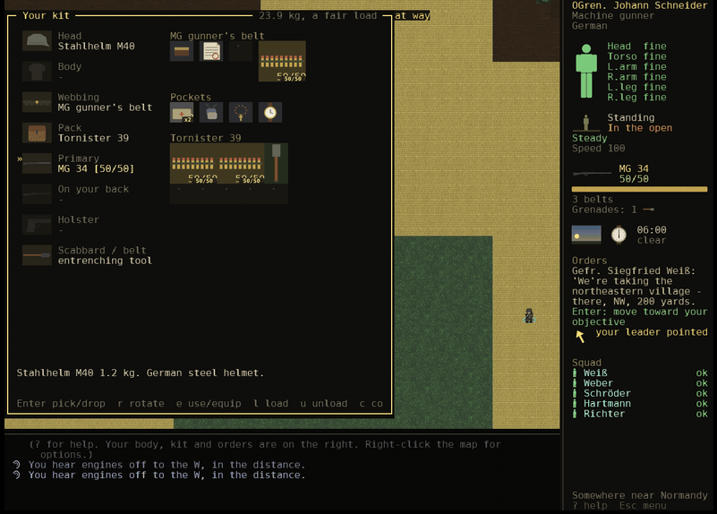<br>
<b>Kit and body.</b> A Tarkov-style grid for webbing, pack and pockets; searching the dead; and a
body with no hit points: wounds, blood, pain, breath, cold and heat.</td>
<td width="50%">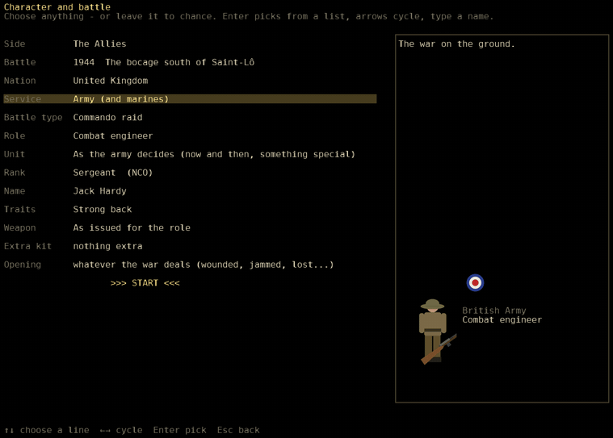<br>
<b>The creator.</b> Side, battle, nation, service, battle type, role, rank up to five stars,
name, traits, weapon and kit. Leave any of it to chance.</td>
</tr>
</table>

## What's in it

- **26 battles, 1939-1945**, from the Bzura to Berlin, Guadalcanal to Kohima, playable on either
  side; **16 nations**, each with its own rank ladder, names, decorations, doctrine and language.
- **Period kit, filtered by nation and date**: 130 small arms that jam, overheat and ping; AT
  weapons, flamethrowers, mortars, mines; 135 vehicles and guns; 56 aircraft; 45 classes of ship from PT boats
  to fleet carriers.
- **An endless world.** Walk off the edge of the battlefield and you're in the next sector: the front
  runs on, the rear goes back to depots and airfields, the country changes. The war is simulated in
  a wide bubble around you, and what you destroy has consequences beyond your map.
- **Everything breaks**: craters, rubble, collapsing bridges, spreading fire, smoke, cooking-off
  ammunition.
- **The lie of the land**: every sector has real relief (balkas on the steppe, the hills the maps
  named, a volcano on Iwo Jima), so crests hide men and high ground sees over the hedges. Buildings
  have floors: snipers in church towers, machine guns at upstairs windows, cellars against the
  shelling.
- **Places worth fighting over**: every sector has its landmarks, by country - a windmill on its rise,
  a railway halt with goods wagons on the siding, a château behind its park wall, the village cemetery,
  a brickworks chimney, a quarry, a slag heap, the grain elevator and the kolkhoz on the steppe, a
  coconut plantation and a mission church in the Solomons, a shrine behind its torii on Okinawa, a
  pagoda, a desert fort and a marabout's tomb, a castle on its hill, a lighthouse above the beach, a
  Würzburg radar station, a landing ground, an oasis, a sawmill, a tank farm that goes up in flames.
  Calvaries stand at the crossroads, the memorial to the last war in the square. They're real terrain
  and they're the objectives.
- **Ground you can read**: what you can't walk through stands up out of the ground with a dark rim and
  a shadow (trees, palms, hedgerows, walls, wagons); undergrowth, crops and rubble lie flat. The look
  says the going ("Very slow going (x2.6 the time) - you can't see into it"), and `X` tints the ground:
  red for no way through, amber for slow.
- **Command at every level.** Orders travel by voice, hand signal, radio, relay or runner, and
  arrive late or not at all. When your leader falls, the next man takes over, and sometimes that's
  you. Promotion, battlefield commissions, and each nation's medals.
- **The roads behind the line** are full of convoys, columns and ambulances, and cutting them starves
  the front they feed, on the war map and in its battles. Orders come several at a time, each with
  who gave it, when it's due, and the reward and punishment your army really used. Autopilot, and an
  optional succession mode: die, and carry on as someone else on the same battlefield.
- **Talk to anyone, and listen to the war**: every soldier has a home, a family and an opinion of you;
  ask him how he's holding up, what he's seen, for a smoke or a trade; get a prisoner to talk. In a fight
  the wounded scream in their own language and their buddies shout their names; in a lull men share
  cigarettes, trade, pray and hum songs from home. Serve in the division of your choice - the Big Red
  One, the Desert Rats, Rodimtsev's Guards, Großdeutschland - with its real regiments and commanders.
- **An interface you can read at a glance**: the panel draws your body with its wounds and dressings,
  your stance behind real cover, the rounds you know are in the magazine, the sky and your watch. The
  kit screen draws every item, aiming shows a sight picture, and the war map is an inked map sheet.
  All the words stay beside the pictures.
- **Squads fight by the manual**: section leaders call targets, the machine gun first; being shot at is
  contact whether or not anyone's seen the shooter; teams fire and move in rushes from cover to
  cover; smoke goes down in front of a machine gun; defenders hold their fire until the attack is
  close; tanks keep pace with their infantry and turn their front armour toward the gun that can
  kill them.
- **Kinds of war**: front-line battles, the big push, holding the line, tank battles, night patrols,
  commando raids, agents behind the lines (SOE, OSS, Jedburghs, the Cichociemni, partisan organisers,
  Abwehr and Greif) with covers, silenced weapons, suitcase radios, detector cars and night supply
  drops from real special-duties squadrons, resistance bands, encirclement, the
  rearguard, captivity and escape; at sea, surface actions, carrier battles, convoys and submarine
  patrols; in the air, fighter sweeps, interceptions and bomber raids.
- **Waiting without mashing keys**: `Z` waits until something happens, for a set time, till dawn or
  till new orders. **Pass time regardless of events...** continues for up to a day despite combat,
  wounds or orders. Every second is simulated for everyone, with drawing batched for speed.
  Any key cancels; death or succession ends the wait.
- **Weather with consequences**: storms, blizzards, wind, rain and snow change visibility, sound,
  exposure, shooting, flying and sailing. Mud, flooded trenches and drifts persist after the sky clears;
  rain, wind and thunder are audible, with shelter and waterproof kit making a difference.
- **The home front on both sides**: more intact inhabited country deeper behind the lines, with
  workshops, hospitals, power stations, food stores and railway yards. Civilians flee the fighting,
  need relief and can be escorted to care. Capture preserves undamaged civilian facilities.
- **Finite supply and counterintelligence**: stores feed repairs, medicine, ammunition draws and fuel;
  road routes, convoys and transport sorties replenish them. Security troops investigate sightings and
  wireless bearings, check movement papers and hunt saboteurs. Twelve more aircraft, eight more ships,
  eleven terrain types and thirteen items support these systems. See [the expanded systems](docs/SYSTEMS_EXPANSION.md).
- **Honest time.** Aiming takes time, recoil throws off the next shot, captured weapons are clumsy
  until you learn them, breath and fatigue and load govern your speed.
- **The same rules for everyone.** Pace, breath, cold, heat, stealth and wounds apply to every
  soldier on both sides. Snipers in ghillie suits, lying still in the right grass, may never be seen.
- **Bases behind the line**, run by real people at real posts: the adjutant with your next orders
  (dispatches, patrols, rejoining the line, guard duty), the clerk with your pay and your mail,
  the armourer, the cook, the chaplain, the MPs, the port director with the boat back to your ship.
- **The navy between battles**: win, and she's sent on to the next job, or back to base to refuel,
  rearm and repair while you go ashore on liberty. Be back aboard by 0500.
- **Fire support that exists.** Every shell and aircraft belongs to a real unit: named batteries at
  the artillery positions, a mortar platoon with each battalion, warships off the beach, squadrons at
  their airfields. Calls go to one that can reach and has rounds, or the answer is no. Find their
  guns, silence them, or serve one yourself on the gun line.
- **Tanks that need looking after**: thrown tracks the crew spend half an hour hammering back on,
  engines and guns that need fitters, racks that run dry. Ammunition trucks come up from the rear
  when it's quiet; infantry lend a hand, ride on the engine decks, and get sent to carry shells.
  The motor sergeant will give you a truck and the tanks to take it to.
- **Vehicles made of parts, not hit points**: a broken track stops a tank moving but not shooting, a
  jammed turret means swinging the hull to aim, smashed sights mean open sights, a crewman hit leaves
  his seat empty until another climbs across. Hover over one to see its state (the enemy's: only what
  shows). What you see from a tank depends on your seat and whether your head's out of the hatch.
- **The real sun and moon**: every battle has its place and its clock, so a dawn attack starts in the
  half-light it really started in, and the D-Day drop goes in under a full moon.
- **Everything around you in a list** (`V`, as in Cataclysm), and **everyone armed as their army
  armed them**, down to the medic who goes unarmed and trusts the red cross.
  Compatible ammunition and magazines are marked green **[P]** for your primary, blue **[S]** for your
  secondary or holstered weapon, and violet **[P/S]** for both.
- **Diegetic.** Menus open from your soldier. Without a watch you don't know the time; without a
  map or compass, sounds are vague and objectives are wherever your sergeant points.
- **Everything is generated**: the battlefields, the sprites (painted by code, soldiers drawn from
  what they're actually carrying), and every sound.

## Documentation

- [**The manual**](docs/GAMEPLAY.md): everything the game does.
- [**Controls**](docs/CONTROLS.md): every key and click, screen by screen.
- [**Survivability proposals**](docs/SURVIVABILITY_DESIGN.md): longer lives through preparation and squad support.
- [**How it's built**](docs/ARCHITECTURE.md): the simulation, the AI, the war at sea, the renderer.
- [**Working on it**](docs/DEVELOPMENT.md): running headless, tests, the fuzzer, making these GIFs,
  adding weapons, ships and battles.

## Credits

Built on [python-tcod](https://github.com/libtcod/python-tcod) and SDL. The AI follows RogueBasin's
[The Incredible Power of Dijkstra Maps](https://www.roguebasin.com/index.php/The_Incredible_Power_of_Dijkstra_Maps).
Inspired by *Cataclysm: Dark Days Ahead*. Fonts: DejaVu Sans Mono and libtcod's bitmap sheets (see
[`assets/CREDITS.md`](assets/CREDITS.md)).
